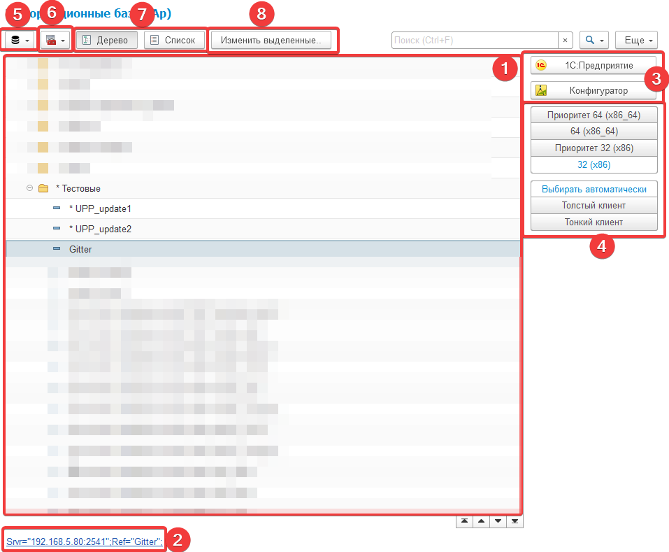
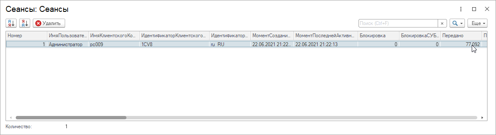

# Автоматизация РУтины
Расширение для [конфигурация "Управление задачами"](https://github.com/BlizD/Tasks) с автоматизацией повседневных задач

## Возможности
* ### Выгрузка файла сравнения/объединения конфигурации по документу "Выпуск релизов"
* ### Выгрузка последней версии хранилища конфигурации
* ### Помощник сборки релиза

    
    В рамках данного помощника формируется
    * Документы "Выпуск релиза"
    * Файлы конфигурации
    * Файлы сравнения/объединения конфигураций

* ### Работа с информационными базами
Позволяет работать со списком информационных баз. 
Информационные базы считываются с настроек пользователя в справочник "Информационные базы".
Позволяет хранить логины/пароли информационных баз и хранилищ.
Добавлена возможность работать с консолью администирования по COM.
В данный момент нет возможности добавить информационную базу в локальный список баз, только изменение некоторых свойств.

1) Динамический список информационных баз пользователя
2) Адрес информационный базы
    * при нажатие в буфер копируется путь  базы
3) Кнопки открытия режима 1с
4) Динамические настройки изменения свойств текущей информационной базы
5) Кнопки обновления списка баз
    * Обновить все реквизиты - обновление всех данных согласно списку информационных баз
    * Обновить обязательные настройки - обновление обязательных данных согласно списку информационных баз
    * Удалить сохраненные настройки - очистка настроек сеанса пользователя
6) Кнопки работы с консолью администрирования
    * Работа с свойствами информационной базы

    
    * Работа с сеансами информационной базы
    
    
    * Работа с соединениями информационной базы
7) Выбор режима отображения списка информационных баз
8) Групповое изменение информационных баз